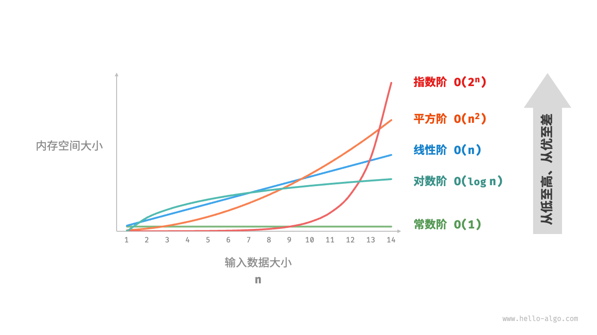

# 算法学习路线

## 从总体上看，我们可以将学习数据结构与算法的过程划分为三个阶段。

1. 阶段一：算法入门。我们需要熟悉各种数据结构的特点和用法，学习不同算法的原理、流程、用途和效率等方面的内容。
2. 阶段二：刷算法题。建议从热门题目开刷，先积累至少 100 道题目，熟悉主流的算法问题。初次刷题时，“知识遗忘”可能是一个挑战，但请放心，这是很正常的。我们可以按照“艾宾浩斯遗忘曲线”来复习题目，通常在进行 3～5 轮的重复后，就能将其牢记在心。推荐的题单和刷题计划请见此 GitHub 仓库。
3. 阶段三：搭建知识体系。在学习方面，我们可以阅读算法专栏文章、解题框架和算法教材，以不断丰富知识体系。在刷题方面，可以尝试采用进阶刷题策略，如按专题分类、一题多解、一解多题等，相关的刷题心得可以在各个社区找到。

## 基础知识

while 循环比 for 循环的自由度更高。在 while 循环中，我们可以自由地设计条件变量的初始化和更新步骤。更新条件中，如果变量要进行两轮更新，用while更加方便，如：
```
/* while 循环（两次更新） */
int whileLoopII(int n) {
    int res = 0;
    int i = 1; // 初始化条件变量
    // 循环求和 1, 4, 10, ...
    while (i <= n) {
        res += i;
        // 更新条件变量
        i++;
        i *= 2;
    }
    return res;
}
```
## 递归：
递归（recursion）是一种算法策略，通过函数调用自身来解决问题。它主要包含两个阶段。

1. 递：程序不断深入地调用自身，通常传入更小或更简化的参数，直到达到“终止条件”。
2. 归：触发“终止条件”后，程序从最深层的递归函数开始逐层返回，汇聚每一层的结果。

而从实现的角度看，递归代码主要包含三个要素。

1. 终止条件：用于决定什么时候由“递”转“归”。
2. 递归调用：对应“递”，函数调用自身，通常输入更小或更简化的参数。
3. 返回结果：对应“归”，将当前递归层级的结果返回至上一层。

### 调用栈：
递归函数每次调用自身时，系统都会为新开启的函数分配内存，以存储局部变量、调用地址和其他信息等。这将导致两方面的结果。

1. 函数的上下文数据都存储在称为“栈帧空间”的内存区域中，直至函数返回后才会被释放。因此，递归通常比迭代更加耗费内存空间。
2. 递归调用函数会产生额外的开销。因此递归通常比循环的时间效率更低。
（在实际中，编程语言允许的递归深度通常是有限的，过深的递归可能导致栈溢出错误。）

### 尾递归
有趣的是，如果函数在返回前的最后一步才进行递归调用，则该函数可以被编译器或解释器优化，使其在空间效率上与迭代相当。这种情况被称为尾递归（tail recursion）。

1. 普通递归：当函数返回到上一层级的函数后，需要继续执行代码，因此系统需要保存上一层调用的上下文。
2. 尾递归：递归调用是函数返回前的最后一个操作，这意味着函数返回到上一层级后，无须继续执行其他操作，因此系统无须保存上一层函数的上下文。

将结果变量 res 设为函数参数，从而实现尾递归：
```
/* 尾递归 */
int tailRecur(int n, int res) {
    // 终止条件
    if (n == 0)
        return res;
    // 尾递归调用
    return tailRecur(n - 1, res + n);
}
```
### 递归树
当处理与“分治”相关的算法问题时，递归往往比迭代的思路更加直观、代码更加易读。

## 时间复杂度
时间复杂度分析统计的不是算法运行时间，而是算法运行时间随着数据量变大时的增长趋势。
常数阶、对数阶、线性阶、平方阶、指数对数阶、指数阶、阶乘阶
最佳时间复杂度、最差时间复杂度（更常用）

## 空间复杂度
与时间复杂度不同的是，我们通常只关注最差空间复杂度。这是因为内存空间是一项硬性要求，我们必须确保在所有输入数据下都有足够的内存空间预留



在大多数情况下，时间比空间更宝贵，因此“以空间换时间”通常是更常用的策略
常数阶、对数阶、线性阶、平方阶、指数阶

## 数据结构分类
逻辑结构可分为“线性”和“非线性”两大类。线性结构比较直观，指数据在逻辑关系上呈线性排列；非线性结构则相反，呈非线性排列。

* 线性数据结构：数组、链表、栈、队列、哈希表，元素之间是一对一的顺序关系。
* 非线性数据结构：树、堆、图、哈希表。
非线性数据结构可以进一步划分为树形结构和网状结构。

* 树形结构：树、堆、哈希表，元素之间是一对多的关系。
* 网状结构：图，元素之间是多对多的关系。

所有数据结构都是基于数组、链表或二者的组合实现的

链表在初始化后，仍可以在程序运行过程中对其长度进行调整，因此也称“动态数据结构”。数组在初始化后长度不可变，因此也称“静态数据结构”。值得注意的是，数组可通过重新分配内存实现长度变化，从而具备一定的“动态性”。